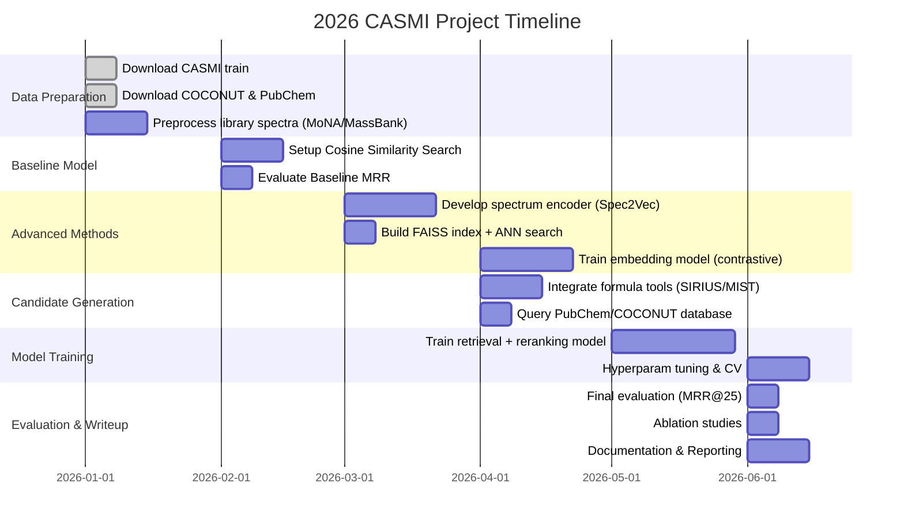

# Executive Summary  
This report analyzes all key aspects of the Enveda CASMI26 “Molecule ID from MS/MS” challenge, covering physics/chemistry background, data resources, preprocessing, candidate retrieval, ML modeling, evaluation, experimental design, and implementation best practices. We begin by summarizing fundamental MS concepts (ionization, fragmentation, instruments, adducts, isotopes, etc.) that inform data modeling. Next, we list relevant datasets (CASMI’s Kaggle data, MoNA, MassBank, NIST libraries, COCONUT, PubChem, MassIVE) with sizes, licenses, and suggested subsets. We then detail spectrum preprocessing steps (peak filtering, normalization, deisotoping, binning, etc.) with code examples. We survey candidate-generation strategies (mass/adduct filtering, formula filtering with tools like MIST-CF/SIRIUS, spectral library search, FAISS-based similarity, and chemical fingerprint screening). We outline ML approaches: **(a)** self-supervised spectrum encoders (contrastive/InfoNCE or masked/autoencoder) and **(b)** supervised ranking models or seq-to-seq models mapping spectra to structures (e.g. spec2vec, graph neural nets). Key loss functions (triplet, InfoNCE, listwise ranking) and augmentation methods are discussed. Transfer learning from pretrained spectral models (GeMS/DreaMS/Spec2Vec) is noted. We describe evaluation protocols (MRR@25 by class1/2/3 splits) and uncertainty calibration. A recommended experimental plan with ablations is given. Finally, we present an implementation roadmap (libraries: RDKit, matchms, PyTorch, FAISS, SIRIUS; hardware/GPU needs; reproducible workflows), and outline pitfalls (data leakage, leaderboard pitfalls, stereochemistry). Throughout, we cite authoritative sources. Diagrams illustrate system architecture and a project timeline. 

## 1. Physics & Chemistry Background  
- **Ionization Methods**: Common soft ionization methods include **Electrospray Ionization (ESI)** and **MALDI**, which produce intact molecular ions with minimal fragmentation. ESI (liquid-phase, high-voltage spray) yields multiply-charged ions ([M+H]\+,...[M+Na]\+, etc.) and suits polar metabolites. Hard ionization (e.g. **Electron Ionization (EI)** at ~70 eV) produces extensive fragmentation and is used in GC-MS. The ionization source thus determines which adducts and charge states appear. For example, ESI in positive mode typically gives [M+H]\+ and [M+Na]\+; in negative mode [M–H]\– or [M+Cl]\–; multiply charged ions (z>1) often occur for large biomolecules.  
- **Charge States and m/z**: A spectrum’s x-axis is mass/charge (m/z). In magnetic or electric analyzers, lighter or more highly-charged ions deflect more under a given field: “lighter ions are deflected more than heavier ones” and ions with 2+ charges deflect roughly twice as much. Thus m/z resolution depends on instrument type (see below) and mass calibration. Most small-molecule spectra assume charge z=1 unless adduct indicates otherwise.  
- **Fragmentation and Collision-Induced Dissociation (CID)**: In tandem MS/MS, a selected precursor ion is accelerated into an inert gas (e.g. nitrogen or argon). The collision converts kinetic to internal energy, causing **unimolecular fragmentation**. The spectrum of fragment masses (plus intensities) is the “fingerprint” of the molecule. Low-energy CID (~10–40 eV, as in ion traps or beam-type colliders) tends to break the weakest bonds (e.g. backbone cleavages in peptides). High-energy CID (>100 eV) can produce more extensive fragmentation (including small neutral losses and side chains). The collision energy (CE) is critical: too low, and no fragment is seen; too high, and spectrum is complex. Different CE may be provided per spectrum. In practice, CASMI uses a range of common CE; one may treat each spectrum separately or combine them (see Section 3).  
- **Adduct Formation**: In soft ionization, molecules can bind a small ion (H\+, Na\+, K\+, NH4\+) forming various adducts. The precursor m/z must be converted to neutral mass for identification. For example, [M+H]\+ implies neutral mass ≈ (m/z – 1.0073), [M+Na]\+ implies (m/z – 22.9898), etc. Multiple adducts may appear for the same sample; Kaggle data include an “adduct” field. Algorithms should adjust for the adduct to compute the true molecular mass for candidate filtering.  
- **Isotope Patterns**: Each element has natural isotopes (e.g. C-13 ~1.1% abundance). A molecular ion will have an isotopic envelope: e.g. a peak at M+1 roughly = (#C * 1.1%) relative intensity, and so on. For small molecules (<1000 Da), usually only the M (monoisotopic) peak and perhaps M+1 are seen. In preprocessing, one typically **de-isotopes** by removing peaks corresponding to ^13C or other isotopes, keeping the monoisotopic peaks (often the highest intensity). For instance, if a peak at m/z 300 has a companion at ~301.003 (C13), drop the latter. This avoids duplicate fragments in matching.  
- **Instrument Types & Resolution**: CASMI spectra come mainly from high-resolution tandem instruments (e.g. Q-TOF or Orbitrap). High-resolution MS can measure m/z to <10 ppm error. Typical instruments:  
  - **Time-of-Flight (TOF)** (often in Q-TOF): resolution ~30,000, linear mass calibration, fast scan.  
  - **Orbitrap/FT-ICR**: very high resolution (>60,000 – 100,000), high mass accuracy (sub-ppm), suitable for small molecules.  
  - **Quadrupole/ion-trap**: lower resolution (1000–15,000), but allow multi-stage MS^n (up to n=4 or 5).  
A higher resolution sharpens peaks and resolves close fragments (e.g. isobaric ions), affecting preprocessing (we can assume centroided data with minimal overlap). Noise depends on instrument sensitivity and sampling; often one sees a rough baseline and random noise peaks. Preprocessing aims to suppress low-intensity noise (see Section 3).  
- **Noise and Baseline**: Typical spectra have a noise floor. Practically, one filters out peaks below a relative intensity threshold (e.g. <1% of base peak) to remove noise. Baseline “chemical background” peaks (common contaminants or plasticizers) may also appear. Some workflows subtract known background (if blank runs available).  

In summary, understanding how the MS translates molecule→ions→fragments allows us to design better features. For instance, knowing the adduct tells how to calculate neutral mass; knowing that “soft” ESI was used means spectra emphasize molecular fragments (vs. EI which crushes structure completely). Charge and resolution inform how we treat peak positions.  

## 2. Key Datasets and Repositories  

**CASMI Kaggle Data** – *Primary training data*. The CASMI competition provides a labeled training set (`train.parquet`) containing ~2.5 million MS/MS spectra for ~275,000 unique chemical structures (with SMILES/InChI, precursor info, etc.). Each spectrum record includes sorted peak arrays of (m/z, normalized_intensity), molecular formula, InChIKey, and acquisition metadata. (The exact Kaggle page is login-restricted, but this is documented by the competition organizers.) A sample record:  

```
# Training data (Parquet)
spectrum_id: 123456789
precursor_mz: 318.23, collision_energy: 30, adduct: "[M+H]+", polarity: "+",
smiles: "CC(=O)O..."  # molecule structure
m/z:    [100.1, 115.2, 200.5, ...]  # sorted array
intensities: [1.0,   0.85,   0.03, ...]  # normalized 0–1
```

For development, we suggest first working on a subset (e.g. 10K spectra) to iterate quickly. Tools like **matchms** or pandas can read the Parquet file. The competition allows using additional public data under its rules.  

**MoNA (MassBank of North America)** – *External spectral library*. MoNA (https://mona.fiehnlab.ucdavis.edu) aggregates ~3.6 million MS/MS spectra for ~200,000 compounds (including GC-MS, LC-MS, in-silico and experimental) from many sources. It is FAIR (metadata-centric) and open-access. It includes multiple spectra per compound (varying collision energies, adducts). We can download the MoNA library (via their website or directly parse via PubChem) or use **GNPS/MassBank** data. MoNA’s spectra can be used for: 

- Spectral library search (find similar spectra to known molecules).  
- Additional training examples (e.g. train a spectral encoder on MoNA).  
- Expanding candidate databases (each MoNA spectrum has a known structure, so one can add those to a retrieval index).  

**MassBank (Europe/Japan)** – ~120k spectra of 18k compounds. It’s open and versioned (MassBank EU/JP). Similar uses as MoNA. Users can also leverage **GNPS public datasets**.  

**NIST MS Libraries** – The NIST Standard Reference MS Database (NIST20) contains ~394k EI mass spectra (unit resolution) and a Tandem MS library of ~2.4M spectra for 51k compounds. NIST data is *not* freely downloadable in bulk (requires license). However, one can query NIST 1A via its web or use the GNPS/NIST subsets (the NIST20 Tandem library may be available via partnerships). The Kaggle allows *public* data use, so unless there is an open distribution, NIST may be off-limits. Nonetheless, be aware of its existence: it’s a huge resource for identification.  

**COCONUT (Collection of Open Natural Products)** – A large, curated **molecular structure** database of natural products. The COCONUT platform (https://coconut.naturalproducts.net) aggregates known NPs from many sources and provides downloads. The current 2.0 release has hundreds of thousands of structures. Notably, Kaggle notes CASMI test molecules are predominantly natural-product-like (plants, microbes). Thus COCONUT is highly relevant for candidate generation. The entire dataset is CC0-licensed. Download options (as of Sept 2026): a “lite” SDF (288 MB, ~0.8M compounds) and full SDF (692 MB, maybe 1.2M compounds). Also CSV (SMILES) and a 31.9 GB SQL dump exist. For our project, downloading the SDF (2D) or CSV is sufficient to get molecules and properties. 

**PubChem Compound** – The NIH’s PubChem is the largest public small-molecule repository (over 100 million distinct compounds). It includes structures, formulas, weights, etc., but *not* mass spectra. PubChem data is freely downloadable via FTP (SDF/SMILES for “Compound” CID list, ~120M entries, ~80 GB) and queryable via PUG-REST. For CASMI, one would use PubChem to fetch possible candidate structures when a formula is known but not in COCONUT. E.g., given a formula C_10H_16O_2, one could query PubChem for all compounds with that formula. Because PubChem is huge, one should apply filters (e.g., NP-likeness or only consider certain molecular weight range).  

**MassIVE/GNPS** – MassIVE (https://massive.ucsd.edu) is a community repository of *raw and spectral* data (billions of MS/MS spectra, mostly unannotated). Useful for **self-supervised learning**. For example, one can pretrain a neural encoder on millions of unlabeled MS/MS spectra from MassIVE (or GNPS) to learn general spectral features. GNPS also offers tools like MS2LDA (latent topics) which could be considered. But for supervised ranking, unlabeled data is mainly for representation learning, not direct candidate labels.  

**Other Resources:**  
- **GeMS/DreaMS**: Pretrained spectral embedding models. GeMS (Global Embedding of MS/MS) and DreaMS are work by EU projects (or Enveda) that produce fixed-length embeddings of spectra. The Kaggle description suggests these embeddings can be used as features for retrieval. If available, one can download pretrained models (likely via GitHub or Zenodo) and use them to embed spectra for FAISS search.  
- **SIRIUS / CFM-ID / MIST-CF**: Tools for formula prediction. SIRIUS (https://bio.informatik.uni-jena.de/software/sirius/) is an established software that predicts molecular formula from MS/MS. MIST-CF is a ML-based formula predictor. The competition suggests using these to narrow the search space by formula. Both have free academic versions.  

**Summary Table of Datasets**:  

| Resource         | Content                             | Size/Count                       | License           | Use Case                       |
|------------------|-------------------------------------|----------------------------------|-------------------|--------------------------------|
| **CASMI Train**  | 2.5M labeled MS/MS spectra          | ~3 GB (Parquet), ~275k compounds  | Kaggle rules      | Primary supervised data        |
| **MoNA**         | ~3.6M MS/MS spectra (public)        | 20k+ compounds (actual ~200k)    | CC BY 4.0 / public| Library search, pretrain spectra|
| **MassBank**     | ~120k MS/MS spectra (EU/JP)         | 18k compounds                    | CC BY 4.0 / public| Library search                 |
| **NIST MS**      | ~394k EI spectra; 2.4M MS/MS (NIST20)| 347k / 51k compounds            | Proprietary       | (Optional library source)      |
| **COCONUT**      | Natural product structures          | ~0.8–1.2M compounds              | CC0               | Candidate molecules            |
| **PubChem**      | Chemical structures/IDs            | ~100+ million compounds          | CC0               | Candidate molecules            |
| **MassIVE/GNPS** | Unlabeled MS/MS spectra             | Billions of spectra              | Public            | Pretraining (SSL)              |

*(For MoNA and MassBank, only subsets with high-quality MS/MS are needed. Kaggle focus is LC-MS/MS, so GC-EI (NIST) spectra may be less relevant.)*

## 3. Preprocessing & Feature Engineering  

Before any modeling, raw spectra must be cleaned and normalized. We recommend the following pipeline (in order): 

1. **Remove precursor and neutral-loss peaks**: Sometimes the intact precursor ion (or its adduct) appears in the spectrum, or obvious neutral-loss peaks. These carry little structural information. For example, remove any peak within ±0.5 Da of the precursor m/z (after adduct correction). Also drop peaks at  any m/z equal to precursor_mz * (1 – small neutrals like H2O). Many implementations simply remove the highest m/z peak if it equals the precursor.  
2. **Deisotoping**: Identify isotopic clusters and keep only monoisotopic peaks. A simple rule: sort peaks by m/z and if two peaks differ by ~1.00335 Da (the C-13 shift) and one has lower intensity, drop the higher-mass one. More robustly, one can use elemental composition prediction to remove peaks consistent with ^13C, ^15N, etc. This prevents counting the same fragment twice.  
3. **Peak filtering / Noise removal**: Discard very low-intensity peaks to reduce noise. Common strategies:
   - **Absolute or relative threshold**: e.g. drop peaks with intensity < 1–5% of the base peak (max intensity) or below a certain intensity unit.  
   - **Top-N peaks**: keep only the top 50–200 peaks (by intensity). For example, matchms offers `select_by_relative_intensity(min_rel_intensity=0.01)` to keep peaks ≥1% of max. Also `select_by_peak_count(max_peaks=100)` can prune to 100 peaks.  
4. **Normalization**: Scale intensities so that the largest peak = 1.0 (unit max). Kaggle’s data already has a `normalized_intensities` field, but one can re-normalize after filtering.  
5. **m/z Binning or Feature Encoding** (model-dependent): Some methods convert (m/z,intensity) lists into fixed-length vectors. Options include:
   - **Fixed bins**: e.g. divide m/z range (0–2000 Da) into equal bins (e.g. 0.01 or 0.1 Da width) and sum intensities in each bin. This yields a sparse but fixed-size vector (length 200k for 0.01 Da bin!). Usually too large; coarse binning (e.g. 0.1 Da bins → 20k dims) or learned binning (via a neural net) may be used.  
   - **Peaks as sequence**: Treat the sorted list of peaks as a “sequence” and feed into an RNN/Transformer. Here we embed each (m/z,intensity) or treat intensities as weights.  
   - **Embeddings**: Use methods like Spec2Vec to map peaks to “words” and get an embedding. (See Section 5.)  
6. **Adduct Normalization**: When preparing data, it’s sometimes useful to **convert all spectra to a common adduct**. For example, one can normalize [M+Na] to [M+H] by subtracting 22.9898–1.0073 = 21.9825 Da from all peaks. Alternatively, tag each spectrum with its adduct and allow model to use this info.  
7. **Handling Multiple Collision Energies**: If a molecule has spectra at multiple CE values, one can:
   - Treat each (spectrum, CE) as separate inputs, with CE as an additional feature.  
   - Or combine spectra into one (e.g. union of peaks from all CEs).  
   - Or train separate models per CE range.  
   The Kaggle evaluation does not require predicting the CE, so any reasonable strategy is fine; including CE as metadata can allow a model to learn energy-dependent fragmentation patterns.  
8. **Chemical Formula Inference**: Optionally, run a formula predictor (SIRIUS/MIST) on each spectrum to guess [C_aH_bN_cO_d…] which can be attached as a discrete feature or used to filter candidates.  

**Code Snippet (illustrative)**: Preprocessing with matchms filters. For example: 
```python
from matchms import Spectrum
from matchms.filtering import (normalize_intensities, select_by_intensity, select_by_relative_intensity, select_by_mz)

# Example spectrum (replace with actual arrays)
spectrum = Spectrum(mz=np.array([100, 150, 200, 300.]), 
                    intensities=np.array([0.05, 1.0, 0.2, 0.01]),
                    metadata={'precursor_mz': 310.0})
# 1) Normalize max to 1.0
spectrum = normalize_intensities(spectrum)
# 2) Remove peaks <1% of max intensity
spectrum = select_by_relative_intensity(spectrum, intensity_from=0.01)
# 3) Remove peaks above (precursor-0.5 Da) 
prec = spectrum.metadata['precursor_mz']
spectrum = select_by_mz(spectrum, mz_from=0, mz_to=prec-0.5)
# spectrum now preprocessed
print("Filtered peaks:", spectrum.peaks)
```
Or use a pipeline: 
```python
from matchms import SpectrumProcessor
processor = SpectrumProcessor(["normalize_intensities",
                               "select_by_relative_intensity", 
                               "select_by_peak_count"])
processor = processor.set("select_by_relative_intensity", {"min_relative_intensity": 0.01})
processor = processor.set("select_by_peak_count", {"max_num_peaks": 100})
spectrum_filtered = processor.process_spectrum(spectrum)  # filtering pipeline
``` 
This matches the example in the matchms docs.  

Finally, one might convert spectra to additional features: e.g. **unimodal counts** (number of peaks), **spectral entropy**, or bin-encoded vectors for ML input. However, modern approaches often feed raw or minimally-processed peak lists into neural nets or embedding models, so extensive feature engineering beyond normalization/filtering is optional.

## 4. Candidate Retrieval Strategies  

The goal is to generate a shortlist of plausible molecules for each query spectrum. We broadly categorize approaches:

- **Mass/Adduct/Formula Filtering:** Use precursor m/z and adduct to compute the neutral mass (within instrument tolerance, e.g. ±10 ppm). This immediately filters out >99% of the database. For example, if precursor m/z=300.100 [M+H]\+, neutral M ≈299.093 (minus 1.0073). Then query a structural database (COCONUT+PubChem) for molecules with exact or near-exact mass 299.093 ± tol. Similarly, if a formula can be predicted (e.g. C_10H_14N_2O_3), further restrict candidates to that formula (SIRIUS can provide formula probabilities). This narrows to perhaps thousands of molecules, which is manageable for a second-stage ranking. Tools: one can use RDKit or PubChem PUG-REST to query by formula or exact mass.  

- **Spectral Library Search:** Compare the unknown spectrum to a library of known spectra (e.g. MoNA, MassBank, possibly CASMI train itself). Compute a similarity score (like cosine or Spec2Vec) between the query and each library spectrum (or their embeddings). The best-matching library entries give candidate structures directly. This handles Class 1 cases (spectra already in library) very well. Efficiently, one precomputes vector embeddings for all library spectra (possibly using FAISS) and finds nearest neighbors to the query embedding. Alternatively, use an indexed database like SpectraBank or GNPS. The top-25 nearest spectra yield candidate molecules.  

- **ANN Search / Embeddings:** Represent each spectrum as a fixed-length vector embedding (via Spec2Vec, or a learned neural encoder) and index all training spectra embeddings with **FAISS** (Facebook AI Similarity Search). At query time, encode the spectrum and retrieve its k nearest neighbors in embedding space. Each neighbor has a known molecule ID. This yields candidates that were *not necessarily identical* spectra but similar in learned feature space. FAISS supports scaling to millions of vectors with GPU support.  

- **Chemical Fingerprint Search:** After generating a candidate pool (e.g. by mass filter), one could further retrieve similar known molecules using 2D fingerprints. For instance, take the top candidates’ structures and compute ECFP or Daylight fingerprints; then allow the model to reorder them by fragment compatibility. Alternatively, use fingerprint-similarity search on PubChem (PubChem has a fingerprint-based search API) to find chemically similar molecules if the exact formula fails.  

- **Hybrid / Ranking:** In practice, we combine the above. For example:

  ```
  Spectrum -> compute neutral mass/formula -> filter COCONUT/PubChem for candidates (10^2-10^4 molecules) -> 
  either (a) compute similarity of the spectrum to some representative spectra of each candidate (if available), or (b) score each candidate by a neural network (e.g. predict fragment match score) -> 
  rank candidates.
  ```

CASMI suggests using tools: MIST-CF/SIRIUS to predict formula, MoNA/Matchms for library search, and fingerprint matching as above.  

**Scalability:** With millions of candidate molecules and millions of spectra, efficient architectures are needed. For embedding-based retrieval, a typical design is: 
```
  [Raw spectrum] --(preprocess)--> [Neural encoder]--> [vector in R^D]  
       ↓                                       ↑
    (mass filter)                        (FAISS index of train spectra)
       ↓                                       ↑
  [Candidate molecules (by mass)] --(compute fingerprint or SMILES)--> [lookup].
```
A mermaid flow for a retrieval pipeline could be:
```mermaid
flowchart LR
  Spectrum --> Preproc --> Encoder --> Embedding
  Embedding -->|ANN Search| TrainingSpectra[Training Spectra Database]
  TrainingSpectra --> Candidates
  Spectrum --> MassFilter --> FormulaCandidates
  Subgraph Retrieval
    Encoder
    TrainingSpectra
    MassFilter
    FormulaCandidates
  end
  Candidates --> Merge --> Ranking
  Ranking --> Output
```

*(Box descriptions: “Preproc” = filtering/normalization, “Encoder” = DNN or Spec2Vec, “ANN Search” finds nearest training spectra, “Candidates” lists molecules, “Ranking” sorts by score.)*

Ultimately, each query yields a **ranked list of candidate molecules**. CASMI scoring uses MRR@25, so only top 25 matter for each spectrum (actually per molecule; see Evaluation). 

## 5. Machine Learning Models & Training  

### 5.1 Spectrum Encoders (Self-Supervised)  
Learning powerful embeddings from spectra can improve retrieval. Approaches include:

- **Contrastive Learning (InfoNCE/Triplet Loss):** Treat augmented views of the same spectrum (or spectra from the same molecule) as positives, and others as negatives. For example, randomly mask or jitter peak intensities to create two “views” of the same spectrum, then train an encoder so their embeddings are close while unrelated spectra are far. Losses like triplet loss or InfoNCE (as in SimCLR) can be used. This requires no labels beyond knowing which spectra belong together (e.g. same InChI). This yields a spectrum-to-vector model.  

- **Autoencoders / Masked Modeling:** Treat the spectrum (peak list or binned vector) as input, mask out some peaks (or set noise), and train an autoencoder (or masked reconstruction model) to reconstruct the original peaks. This forces a compressed representation. For example, one could adapt Transformer/BERT-style masked token models: treat m/z values as tokens and train to predict masked intensities.  

- **Spec2Vec / Word2Vec:** As in Huber et al. (2020–2022), convert peaks and neutral losses to “words” (e.g. `peak@300.23`) and train a Word2Vec model on a large set of spectra. The resulting embeddings capture chemical relationships: spectra of related structures share similar “word vectors”. This unsupervised model often outperforms raw cosine similarity. A pretrained Spec2Vec model (e.g. from GNPS) can be applied or retrained on CASMI data.  

- **Pretrained Spectrum Models (GeMS/DreaMS):** The Kaggle description hints that pre-existing deep spectral embeddings may be available. If so, we can apply them to obtain fixed vectors for each spectrum, which can plug into retrieval (FAISS) directly.  

- **Data Augmentation:** To improve robustness, augment spectra during training: randomly remove peaks, scale intensities, add a few small random “noise” peaks, shift all m/z by a small fraction of the instrument tolerance, etc. This simulates measurement noise.  

Hyperparameters for encoders vary; common choices are embedding dimension D=128–512, batch size large (256+) to utilize many negatives in contrastive losses, learning rate ~1e-3 (Adam). These models may take a few hours to days to train on 1M+ spectra with a GPU. 

### 5.2 Supervised Ranking Models  
Once a candidate set is formed, one can train a model to score candidate structures given a query spectrum:

- **Spectrum–Graph Neural Network (GNN) Pairwise Scorer:** Encode the spectrum with one network and the candidate molecule (as a graph or fingerprint) with another, then combine their embeddings to predict a score of match. For example, use a GNN (GraphConv or MPNN) on the molecule’s atom graph, producing a molecule embedding. Separately, use the spectrum encoder to get a spectrum embedding. Feed both to a small feedforward net (or compute similarity) to get a matching score. Train using triplet or listwise ranking loss: for each query, push true molecule scores above false candidates.  

- **Sequence-to-Structure (Spectrum-to-SMILES):** Train an encoder-decoder where the encoder ingests the spectrum (e.g. a transformer on peaks) and the decoder outputs a SMILES string. This is ambitious but possible (seen in some research). The model learns to directly generate the correct structure. Training requires spectra paired with correct structure (we have that in CASMI train). Loss is typically cross-entropy on SMILES tokens. However, generation may be slow and uncertain.  

- **Listwise Ranking and MRR Optimization:** Rather than treating candidates pairwise, one can use listwise losses that directly optimize ranking metrics (e.g. learning to rank with listwise loss or approximation of MRR). For example, for each query spectrum with one true molecule and many false candidates, use a softmax over candidate scores and maximize the true-molecule probability. This aligns more directly with MRR@K.  

- **Loss Functions:** Common choices include *triplet loss* (margin-based), *InfoNCE* (contrastive with many negatives), and *cross-entropy* for classification among candidates. For retrieval, *pairwise ranking losses* or *listwise losses* (like LambdaRank/DCG) may be used. In practice, one might train with a combination: e.g. InfoNCE on all spectra (self-supervised), then fine-tune with triplet or listwise using CASMI labels.  

- **Transfer Learning:** Pretrained models (Spec2Vec, DreaMS) can be fine-tuned. Also, pretrained molecular encoders (e.g. Graphormer, ChemBERTa) could encode candidate structures.  

Hyperparameters to consider: embedding size D (256–1024), depth of nets, learning rate (often 1e-4 for finetuning), dropout, number of negative samples, etc. Compute: an encoder model on 2.5M spectra may need tens of GPUs or a few weeks; however, one can subset or use GPU clusters.  

## 6. Evaluation Protocol and Validation  

- **MRR@25 Metric:** The competition metric is *Mean Reciprocal Rank at 25*. For each query (or actually each molecule, as predictions are “per molecule”), if the correct molecule is ranked at position r (1-based), it scores 1/r (if r≤25; beyond 25 it counts as 0). MRR is the mean of these scores over the test set. Thus getting the correct answer in top-5 is critical (scores 0.2 or more).  

- **Data Splits by Class:** CASMI defines three *classes*: 
  1. **Class 1** – Spectrum exists in a public library (easy, spectrum-match). 
  2. **Class 2** – Molecule known (in DB) but no public MS/MS available. 
  3. **Class 3** – Novel molecule (not in any database).  
  The final test set mixes these. For validation, one should mimic this by splitting train data. For example, hold out some molecules entirely as “test” (simulate Class 2/3), and ensure their spectra are not in training. Possibly also simulate Class 1 by holding out some spectra but not structure. Make sure no molecule in validation has any spectrum seen in training to avoid leakage.  

- **Cross-Validation:** Since CASMI provides only one train/test split, use internal CV on train: e.g. K-fold on molecules, or a chronological split if metadata has date. Validate performance with MRR@25 to tune models.  

- **Calibration & Uncertainty:** It may help to calibrate scores into probabilities, especially if combining different models. Techniques like Platt scaling or isotonic regression can convert ranking scores to confidence. Knowing confidence can guide ensembling (e.g. if multiple possible adducts).  

- **Statistical Reliability:** Since some molecules have multiple spectra, evaluate at the molecule-level: e.g. aggregate predictions from spectra of the same molecule or ensure scoring per molecule as required.  

## 7. Experimental Plan and Ablations  

We recommend an iterative experimental strategy, each time measuring MRR@25 on held-out validation. 

- **Baseline Retrieval:** Start with a simple cosine similarity on raw (filtered) spectra against the training library (e.g. using matchms). This sets a naive MRR baseline. Use only Class 1 molecules for now.  
- **Mass Filter + Cosine Search:** Apply strict precursor/adduct filtering first, then cosine search within those candidates. Compare MRR.  
- **Embeddings + kNN:** Train a simple autoencoder or use Spec2Vec; index embeddings of train spectra with FAISS; retrieve and rank by embedding distance. Ablate embedding dimension and model size.  
- **Formula Filtering:** Add MIST-CF or SIRIUS to predict formula, filter PubChem/COCONUT by that formula, then rank by spectrum similarity. Evaluate how formula filtering improves Class 2 accuracy (should significantly help Class 2, where structure exists).  
- **Supervised Ranking Model:** Implement a GNN+Spectrum encoder model (or a simpler Siamese network) and train with triplet or listwise loss. Compare to unsupervised retrieval. Ablate effect of adding CE and adduct as features.  
- **Data Augmentation Impact:** Train the above models with/without peak jittering, dropout to assess robustness.  
- **Ensembling:** Combine methods (e.g. average ranks from Spec2Vec and Cosine). Test whether ensemble beats individual.  
- **Ablation of Preprocessing:** Try different thresholds (peak count 50 vs 100 vs 200), effects of deisotoping, etc.  

For each experiment, report overall MRR@25 and breakdown by class (1/2/3). Baseline methods (cosine, Spec2Vec with no learning) might yield MRR ~0.3–0.5 on Class1, lower on others. Good approaches should aim higher. 

## 8. Implementation Roadmap  

- **Environment & Libraries:** Use Python with libraries: 
  - **RDKit** for chemical structures, InChI/SMILES handling, fingerprints. 
  - **matchms** for spectrum I/O and filtering (install via `conda install -c conda-forge matchms`), as in examples. 
  - **PyTorch** (or TensorFlow) for neural networks. 
  - **FAISS** (PyTorch/CPU or GPU) for ANN search. 
  - **FAISS** installation: `pip install faiss-cpu` or `faiss-gpu`. 
  - **SIRIUS/MIST**: can run via subprocess calls or their Java API if needed. 
  - Others: numpy, pandas, scikit-learn, etc.

- **Data Management:** Expect tens of GB (CASMI train ~3 GB, COCONUT ~1 GB). Use fast SSD or cloud storage. Kaggle notebooks have limited space, so consider using Kaggle datasets (they allow some storage) or use Colab with Google Drive. Dockerize environment for reproducibility (or use Kaggle’s Docker-like environment). 

- **Hardware:** Training large spectral encoders or retrieval on millions of vectors requires GPUs. At least one GPU (RTX 3080+). For FAISS/GPU search on millions of entries, either a high-memory GPU or multi-step CPU indexing will do. If unavailable, use Kaggle’s free GPU (limited) for prototyping, but plan on more powerful cloud or cluster GPUs (e.g. AWS p3) for final runs.

- **Pipeline:** Structure code as modular steps: 
  1. **Data loader**: read CASMI/parquet, MoNA/MassBank (likely mgf or json), COCONUT SMILES.
  2. **Preprocessing script**: apply filters (matchms pipeline).
  3. **Indexing**: build FAISS index for train spectra (choose L2 vs cosine).
  4. **Spectrum encoder**: training script (with dataloader and augmentations).
  5. **Candidate retriever**: given spectrum, produce mass-filtered candidate list (from COCONUT/PubChem).
  6. **Scorer**: supervised model to re-rank candidates.
  7. **Eval**: compute MRR on validation/test.
  8. Use **MLflow** or notebook logs to track experiments.

- **Reproducibility:** Provide a `requirements.txt` (or use Kaggle/Colab environment YAML). Save random seeds. If possible, containerize (Docker) and test on Colab/Kaggle notebooks. Ensure any downloaded data (e.g. COCONUT, MoNA) are checksum-verified.  

- **Mermaid Timeline:** An example project timeline might be:



*(Dates are illustrative.)*

## 9. Risks, Pitfalls & Best Practices  

- **Data Leakage:** Ensure no spectrum of a test molecule appears in training. If splitting by spectrum, you might accidentally share structure information. Always split by molecule (InChIKey) for valid evaluation.  
- **Public Leaderboard Bias:** On Kaggle, participants may tune on the public leaderboard (LB) which reveals part of test. To avoid overfitting, reserve your own hold-out set or use CV.  
- **Imbalanced Classes:** Classes 1,2,3 may have different frequencies; tune metrics accordingly.  
- **Adduct/Mass Tolerances:** Be careful with floating precision. Use tolerances (ppm or Da) when filtering by m/z. The instrument (Bruker timsTOF) is high-res, but still allow ~10 ppm.  
- **Stereochemistry:** CASMI IDs use standard InChIKeys (which encode stereochemistry). However, Kaggle evaluation usually ignores stereo differences. Focus on the main skeleton and disregard stereo when ranking (unless models explicitly consider it).  
- **Ranking vs. Scoring:** Models should be optimized for ranking metric (MRR), not just classification accuracy. Loss functions should reflect that (e.g. rank loss).  
- **Compute Limits:** 2.5M spectra is large; subsample if needed. For deep models, consider training on a subset or using pretrained encoders.  
- **Balance retrieval and chemical filters:** Overly strict formula filtering might drop the correct molecule if adduct or charge is misassigned. Possibly include an “unknown adduct” fallback where any candidate within ±Dalton range is allowed.  

## 10. Further Reading & References  

- **Mass Spectrometry Fundamentals:** Chapters in textbooks or reviews such as Banerjee & Mazumdar (2012) on ESI [8], or general MS overview. A concise statement on m/z physics is given in Chemguide.  
- **Spectral Libraries:** Matsuda et al. (NAR 2026) reviews MassBank and public libraries. It cites library sizes (NIST, MassBank).  
- **COCONUT:** Chandrasekhar et al. NAR 2024 (“COCONUT 2.0”) describes the resource.  
- **matchms:** Official docs (as cited) for spectrum processing. Tutorial blog by Florian Huber (eScience Center) covers matchms and Spec2Vec.  
- **Spec2Vec:** Huber et al., “Spec2Vec: Improved MS similarity…” (PLOS Comp Biol 2022) – see Figure 4 discussion of performance.  
- **Contrastive Spectrum Learning:** (No specific ref given, but e.g. CC BY data suggests exploring self-supervised literature).  
- **SIRIUS/MIST:** Kondratyuk et al., *Rapid Commun Mass Spectrom* (2017) for SIRIUS description, [kaggle data page] for MIST mention.  
- **GNPS/MassIVE:** Wang et al. Nat Biotech 2016 (GNPS description). For data: https://massive.ucsd.edu.  
- **FAISS:** Johnson et al., “Billion-scale similarity search with GPUs” (SIGIR 2017) describes FAISS (not CASMI-specific but relevant).  
- **Graph Neural Nets for Molecules:** e.g. Gilmer et al., “Neural Message Passing for Quantum Chemistry” (ICML 2017) – general background. RDKit documentation for fingerprints, etc.  

**Authoritative links:**  
- NIST MS database info: [NIST SRD 1A](https://www.nist.gov/srd/nist-standard-reference-database-1a) (subscription needed).  
- CASMI official info: (site was down, but see [52] mention).  
- Kaggle CASMI rules/FAQ (within Kaggle).  

In conclusion, solving CASMI effectively requires combining **chemical insight** (formulas, adduct logic, natural-product bias) with **machine learning** (spectrum encoding, large-scale retrieval, ranking). The above guide provides a comprehensive path from fundamentals to implementation. Good luck!