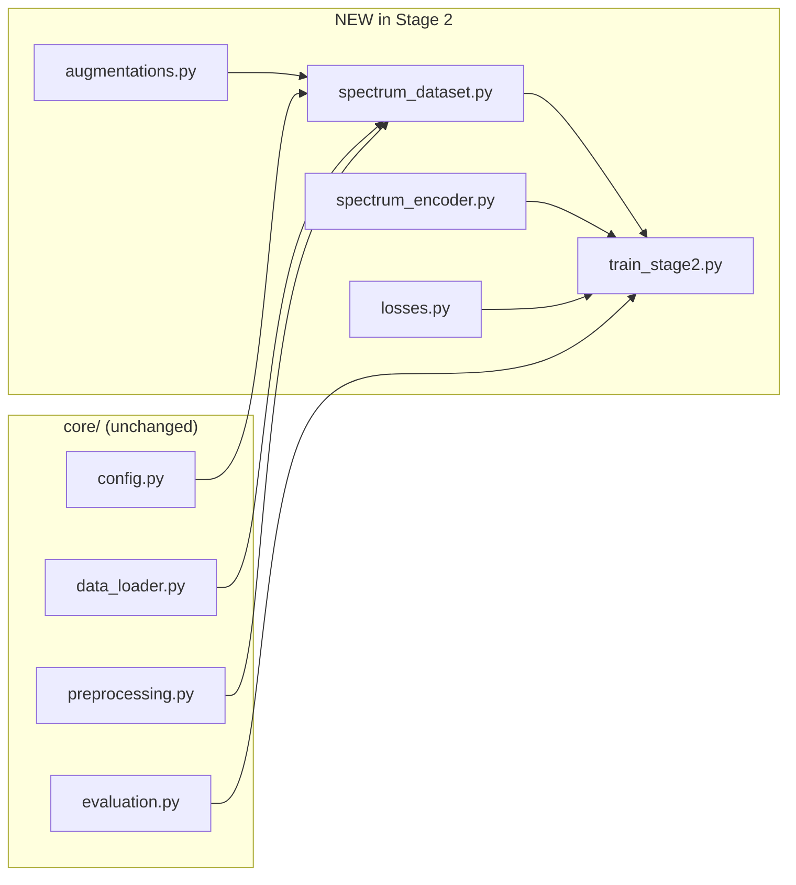
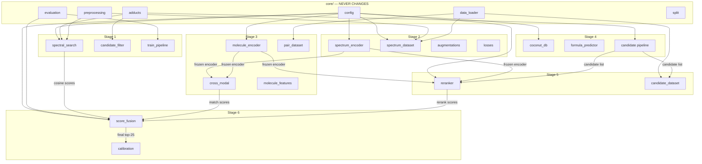

# How the Project Extends — Stage by Stage

## The One Rule

```
Add new files. Never restructure what already works.
```

Every stage adds its own files into the skeleton. Here's exactly what happens at each step.

---

## What We Have Now (after Stage 0–1)

```
src/
├── core/                    ← LOCKED. Touch only to fix bugs.
│   ├── config.py
│   ├── adducts.py
│   ├── preprocessing.py
│   ├── evaluation.py
│   ├── data_loader.py
│   └── split.py
├── search/                  ← LOCKED after Stage 1 is validated.
│   ├── spectral_search.py
│   └── candidate_filter.py
├── models/                  ← Empty skeleton
├── data/                    ← Empty skeleton
└── train_pipeline.py        ← Stage 0/1 orchestrator
```

---

## Stage 2 — Spectrum Encoder

> **Question**: Can a neural network learn better spectrum representations?

### New files

```diff
  src/
  ├── core/                           # NO CHANGES
  ├── search/                         # NO CHANGES
  ├── models/
  │   ├── __init__.py
+ │   ├── spectrum_encoder.py         # 1D-CNN or Transformer on binned spectra
+ │   └── losses.py                   # InfoNCE contrastive loss
  ├── data/
  │   ├── __init__.py
+ │   ├── spectrum_dataset.py         # PyTorch Dataset: loads spectra pairs
+ │   └── augmentations.py            # Peak dropout, intensity jitter, m/z shift
  └── train_pipeline.py               # NO CHANGES

+ scripts/train_stage2.py             # Training loop for contrastive encoder
+ scripts/eval_stage2.py              # FAISS kNN retrieval → MRR@25

+ configs/stage02/
+   ├── exp2a_basic.yaml
+   ├── exp2b_augmented.yaml
+   ├── exp2c_ce_aware.yaml
+   └── exp2d_full_meta.yaml
```

### What imports what



### Example: `spectrum_dataset.py` skeleton

```python
"""PyTorch Dataset for contrastive spectrum learning."""
from torch.utils.data import Dataset
from src.core.config import TRAIN_PATH, N_BINS, BIN_WIDTH, MZ_BIN_MIN
from src.core.data_loader import iter_row_groups
from src.core.preprocessing import preprocess_variant, default_variants
from src.data.augmentations import augment_spectrum

class SpectrumPairDataset(Dataset):
    """Yields (spectrum_A, spectrum_B, same_molecule) triples."""
    
    def __init__(self, meta_df, peaks_index, subset_size=10_000, augment=True):
        # Groups spectra by molecule for positive pair mining
        ...
    
    def __getitem__(self, idx):
        # Returns two augmented views of same-molecule spectra (positive)
        # or different-molecule spectra (negative)
        ...
```

### Example: `spectrum_encoder.py` skeleton

```python
"""1D-CNN spectrum encoder for contrastive learning."""
import torch.nn as nn
from src.core.config import N_BINS, EMBEDDING_DIM

class SpectrumEncoder(nn.Module):
    def __init__(self, n_bins=N_BINS, embed_dim=EMBEDDING_DIM):
        super().__init__()
        self.conv_stack = nn.Sequential(...)
        self.projection = nn.Linear(..., embed_dim)
    
    def forward(self, x):
        # x: (batch, n_bins) binned spectrum
        # returns: (batch, embed_dim) L2-normalized embedding
        ...
```

### Artifacts produced

```
artifacts/stage02/
├── exp2a/
│   ├── config.yaml              # Frozen copy of experiment config
│   ├── checkpoints/
│   │   ├── epoch_05.pt
│   │   └── best.pt
│   ├── metrics.json             # { mrr@25: 0.18, loss: 0.42 }
│   └── embeddings/
│       └── train_embeddings.npy  # For FAISS index
└── exp2b/
    └── ...
```

---

## Stage 3 — Spectrum ↔ Molecule Matching

> **Question**: Can the model understand spectrum ↔ molecular structure?

### New files

```diff
  src/
  ├── core/                           # NO CHANGES
  ├── search/                         # NO CHANGES
  ├── models/
  │   ├── spectrum_encoder.py         # REUSED (frozen from Stage 2)
  │   ├── losses.py                   # EXTENDED (add triplet loss)
+ │   ├── molecule_encoder.py         # GNN on RDKit molecular graph
+ │   └── cross_modal.py              # Spectrum-molecule matching model
  ├── data/
  │   ├── spectrum_dataset.py         # REUSED
  │   ├── augmentations.py            # REUSED
+ │   ├── pair_dataset.py             # (spectrum, molecule) pair batches
+ │   └── molecule_features.py        # RDKit SMILES → PyG graph conversion

+ scripts/train_stage3.py
+ configs/stage03/exp3a_frozen.yaml
```

### Key design: `molecule_features.py`

```python
"""Convert SMILES → PyTorch Geometric graph for GNN input."""
from rdkit import Chem
from torch_geometric.data import Data

def smiles_to_graph(smiles: str) -> Data:
    mol = Chem.MolFromSmiles(smiles)
    # atoms → node features (atomic num, degree, charge, ...)
    # bonds → edge index + edge features (bond type, ring, ...)
    return Data(x=node_features, edge_index=edge_index, edge_attr=edge_attr)
```

### Key design: `cross_modal.py`

```python
"""Spectrum ↔ molecule matching via dual encoders."""
from src.models.spectrum_encoder import SpectrumEncoder
from src.models.molecule_encoder import MoleculeGNN

class CrossModalMatcher(nn.Module):
    def __init__(self, spectrum_encoder, molecule_encoder, embed_dim=256):
        self.spec_enc = spectrum_encoder   # frozen or fine-tuned
        self.mol_enc = molecule_encoder
        self.projection = nn.Linear(embed_dim, embed_dim)
    
    def forward(self, spectrum, mol_graph):
        spec_vec = self.spec_enc(spectrum)        # (B, D)
        mol_vec = self.mol_enc(mol_graph)          # (B, D)
        return spec_vec, mol_vec                   # contrastive loss on these
```

---

## Stage 4 — Candidate Generation

> **Question**: Can physics+chemistry drastically reduce the search space?

### New files

```diff
  src/
  ├── core/                           # NO CHANGES
  ├── search/
  │   ├── spectral_search.py          # REUSED
  │   ├── candidate_filter.py         # EXTENDED (add formula filtering)
  ├── models/                         # NO CHANGES
  ├── data/                           # NO CHANGES
+ ├── candidates/                     # NEW SUBPACKAGE
+ │   ├── __init__.py
+ │   ├── coconut_db.py               # COCONUT SDF/CSV loader + mass index
+ │   ├── pubchem_query.py            # PubChem REST API for structure lookup
+ │   ├── formula_predictor.py        # MIST-CF integration or rule-based
+ │   └── pipeline.py                 # Mass → formula → structure orchestrator

+ scripts/run_stage4.py
+ configs/stage04/candidate_gen.yaml
```

### How the candidate pipeline works

```python
# candidates/pipeline.py
from src.search.candidate_filter import formula_mass_range
from src.candidates.coconut_db import CoconutIndex
from src.candidates.formula_predictor import predict_formula

def generate_candidates(precursor_mz, adduct, spectrum_embedding=None):
    """2.5M molecules → mass filter → formula filter → embedding filter → 500."""
    lo, hi = formula_mass_range(precursor_mz, adduct, ppm_tolerance=20.0)
    candidates = coconut_index.query_mass_range(lo, hi)          # ~100K → 5K
    if formula:
        candidates = [c for c in candidates if c.formula == formula]  # → 500
    if spectrum_embedding is not None:
        candidates = rerank_by_embedding(candidates, spectrum_embedding)
    return candidates
```

---

## Stage 5 — Candidate Reranker

> **Question**: Can we rank the correct molecule above hard negatives?

### New files

```diff
  src/
  ├── models/
  │   ├── spectrum_encoder.py         # REUSED (frozen)
  │   ├── molecule_encoder.py         # REUSED (frozen)
  │   ├── losses.py                   # EXTENDED (add listwise ranking loss)
+ │   └── reranker.py                 # Scoring: spectrum × candidate → score
  ├── data/
+ │   └── candidate_dataset.py        # (spectrum, [candidate_1..N], label) batches

+ scripts/train_stage5.py
+ configs/stage05/exp5a_pairwise.yaml
```

### Key design: `reranker.py`

```python
"""Score a spectrum against a candidate molecule."""
class Reranker(nn.Module):
    def __init__(self, spec_encoder, mol_encoder, hidden=512):
        self.spec_enc = spec_encoder  # frozen
        self.mol_enc = mol_encoder    # frozen or fine-tuned
        self.scorer = nn.Sequential(
            nn.Linear(embed_dim * 2 + n_meta_features, hidden),
            nn.ReLU(),
            nn.Linear(hidden, 1),
        )
    
    def forward(self, spectrum, mol_graph, metadata):
        spec_vec = self.spec_enc(spectrum)
        mol_vec = self.mol_enc(mol_graph)
        meta = encode_metadata(metadata)  # precursor_mz, adduct, CE
        combined = torch.cat([spec_vec, mol_vec, meta], dim=-1)
        return self.scorer(combined).squeeze(-1)  # scalar score
```

### Key design: listwise ranking loss

```python
# In losses.py — EXTENDED, not rewritten
def listwise_ranking_loss(scores, labels, temperature=1.0):
    """Softmax cross-entropy over candidate list. Optimizes MRR directly."""
    logits = scores / temperature
    return F.cross_entropy(logits, labels)  # label = index of correct candidate
```

---

## Stage 6 — Hybrid Ensemble

> **Question**: Does combining independent evidence improve MRR@25?

### New files

```diff
  src/
+ ├── ensemble/                       # NEW SUBPACKAGE
+ │   ├── __init__.py
+ │   ├── score_fusion.py             # Weighted combination / rank fusion
+ │   └── calibration.py              # Platt scaling, weight learning

+ scripts/train_stage6.py
+ configs/stage06/exp6a_linear.yaml
```

### Key design: `score_fusion.py`

```python
"""Combine scores from multiple pipeline components."""
class ScoreFusion(nn.Module):
    def __init__(self, n_features=5):
        self.weights = nn.Parameter(torch.ones(n_features) / n_features)
    
    def forward(self, feature_scores):
        # feature_scores: (batch, n_candidates, 5)
        #   [cosine_sim, neural_sim, spec_mol_score, formula_evidence, metadata_score]
        w = F.softmax(self.weights, dim=0)
        return (feature_scores * w).sum(dim=-1)  # (batch, n_candidates)
```

---

## Stage 7 — Final Training

### New files

```diff
+ scripts/train_stage7.py             # Full 2.5M training with best architecture
+ scripts/submit.py                   # Generate final submission CSV
+ configs/stage07/final.yaml
```

---

## The Full Final Tree (at Stage 7)

```
kaggle-chemistry/
├── configs/
│   ├── stage01/baseline.yaml
│   ├── stage02/exp2a_basic.yaml, exp2b_augmented.yaml, ...
│   ├── stage03/exp3a_frozen.yaml, ...
│   ├── stage04/candidate_gen.yaml
│   ├── stage05/exp5a_pairwise.yaml, exp5d_listwise.yaml, ...
│   ├── stage06/exp6a_linear.yaml, exp6b_mlp.yaml
│   └── stage07/final.yaml
│
├── scripts/
│   ├── run_stage01.py
│   ├── train_stage2.py
│   ├── train_stage3.py
│   ├── run_stage4.py
│   ├── train_stage5.py
│   ├── train_stage6.py
│   ├── train_stage7.py
│   ├── evaluate.py                   # Unified evaluation across stages
│   └── submit.py                     # Final submission generator
│
├── src/
│   ├── core/                         # 7 files — UNCHANGED from Stage 1
│   │   ├── config.py
│   │   ├── adducts.py
│   │   ├── preprocessing.py
│   │   ├── evaluation.py
│   │   ├── data_loader.py
│   │   └── split.py
│   │
│   ├── search/                       # 2 files — UNCHANGED from Stage 1
│   │   ├── spectral_search.py
│   │   └── candidate_filter.py
│   │
│   ├── models/                       # Grows: Stage 2 → 3 → 5
│   │   ├── spectrum_encoder.py       # Stage 2
│   │   ├── losses.py                 # Stage 2, extended in 3, 5
│   │   ├── molecule_encoder.py       # Stage 3
│   │   ├── cross_modal.py            # Stage 3
│   │   └── reranker.py               # Stage 5
│   │
│   ├── data/                         # Grows: Stage 2 → 3 → 5
│   │   ├── spectrum_dataset.py       # Stage 2
│   │   ├── augmentations.py          # Stage 2
│   │   ├── pair_dataset.py           # Stage 3
│   │   ├── molecule_features.py      # Stage 3
│   │   └── candidate_dataset.py      # Stage 5
│   │
│   ├── candidates/                   # Stage 4
│   │   ├── coconut_db.py
│   │   ├── pubchem_query.py
│   │   ├── formula_predictor.py
│   │   └── pipeline.py
│   │
│   ├── ensemble/                     # Stage 6
│   │   ├── score_fusion.py
│   │   └── calibration.py
│   │
│   └── train_pipeline.py             # Stage 0/1 orchestrator (UNCHANGED)
│
├── artifacts/                        # Grows per experiment
│   ├── baseline/                     # Stage 0/1
│   ├── stage02/exp2a/, exp2b/        # Checkpoints, metrics, embeddings
│   ├── stage03/exp3a/
│   ├── stage04/
│   ├── stage05/exp5a/, exp5d/
│   ├── stage06/exp6a/
│   └── final/                        # Stage 7: submission.csv, weights
│
├── external/                         # Stage 4: COCONUT, PubChem downloads
├── notebooks/                        # Optional: EDA, visualization
└── tests/                            # Unit tests per module
```

---

## Dependency Flow Across All Stages



---

## The 4 Extension Rules

### 1. Add, don't modify

New capability = new file. If `losses.py` needs a new loss function, **add** the function — don't restructure the file.

### 2. Freeze what works

Once Stage 2 is done and `spectrum_encoder.py` gives good embeddings, freeze it. Stage 3 loads the frozen encoder. Stage 5 loads the frozen encoder. Nobody rewrites it.

### 3. One script, one experiment

```bash
python scripts/train_stage2.py --config configs/stage02/exp2a_basic.yaml
python scripts/train_stage2.py --config configs/stage02/exp2b_augmented.yaml
```

The script is the same. The config changes. The output goes to a different `artifacts/stage02/exp2X/` directory.

### 4. Core is sacred

`core/` has **zero** imports from `models/`, `data/`, `search/`, `candidates/`, or `ensemble/`. The arrow only goes one way:

```
core/ ← models/, data/, search/, candidates/, ensemble/
```

If you ever feel tempted to make `core/config.py` import from `models/`, that's a sign the design is wrong. Factor the shared part out into core instead.
