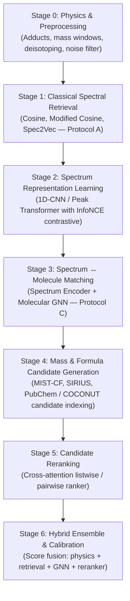

# CASMI26 Multi-Stage Training Roadmap

> **Core scientific goal**: Build a machine learning system that learns transferable relationships between MS/MS fragmentation patterns and 2D molecular structures, so it can identify molecules whose own reference spectra were **never available during retrieval**.

---

## 1. The Three Validation Protocols

To evaluate models scientifically without confusing library lookup with generalization, we establish three distinct protocols:

```mermaid
flowchart TD
    subgraph "Protocol A: Library Identification (CASMI Class 1)"
        PA_Q["Query Spectrum"] --> PA_L["Library (includes sibling spectra of M)"] --> PA_S["Spectral Similarity\n(Cosine / Modified / Spec2Vec)"] --> PA_R["Rank M"]
    end

    subgraph "Protocol B: Chemical / Mass Prior"
        PB_Q["Query Precursor"] --> PB_M["Neutral Mass Window\n(20 ppm)"] --> PB_P["Structure Candidates\n(Popularity / Frequency Prior)"] --> PB_R["Rank M\n(Baseline = 0.0501)"]
    end

    subgraph "Protocol C: ML Generalization (CASMI Class 2 & 3)"
        PC_Q["Query Spectrum"] --> PC_E["Spectrum Encoder\n(z_spec)"]
        PC_C["Candidate Molecules\n(0 spectra of M in library)"] --> PC_G["Molecular GNN\n(z_mol)"]
        PC_E & PC_G --> PC_M["Cross-Modal Scorer\nz_spec · z_mol"] --> PC_R["Rank M without reference spectra!"]
    end
```



| Protocol | Scenario | Reference Spectra in Library | Candidate Source | Key Question | Current Baseline |
|---|---|---|---|---|---|
| **Protocol A** | Class 1 (Known compounds) | **Yes** (sibling spectra present) | Spectral Library | *"Can we identify a molecule when its spectral fingerprint is already represented?"* | **0.7677** (`1F`) |
| **Protocol B** | Physics / Chemistry Floor | **No** (pure mass + prior) | Structure DB | *"How much can chemistry and mass alone tell us before seeing matching spectra?"* | **0.0501** |
| **Protocol C** | Class 2/3 (Novel / Zero-spectrum) | **Zero** (all spectra purged) | Structure DB | *"Can the model identify an unseen molecule from its 2D graph with ZERO reference spectra?"* | Stage 3 target (Beats 0.0501) |

---

## 2. Multi-Stage Progressive Architecture



---

## 3. The 10 Core Scientific Experiments

| Exp | Stage | Core Question | Primary Metric |
|---|---|---|---|
| **E1** | Stage 1 | How good is ordinary binned cosine retrieval? | Protocol A MRR |
| **E2** | Stage 1 | Does modified cosine (precursor mass shift) improve isomer resolution? | Protocol A MRR |
| **E3** | Stage 1 | Does Word2Vec/Spec2Vec learned peak embedding beat classical cosine? | Protocol A MRR |
| **E4** | Stage 0/1 | How much does two-tier mass/adduct filtering improve recall and MRR? | Protocol A MRR + `frac_scored` |
| **E5** | Stage 2 | Does contrastive spectrum pretraining learn CE-invariant embeddings? | Embedding kNN MRR |
| **E6** | Stage 3 | Does a Molecular GNN enable zero-reference retrieval? | **Protocol C MRR** |
| **E7** | Stage 4 | Does formula prediction (MIST-CF / SIRIUS) prune candidates without dropping true IDs? | Candidate recall @ K |
| **E8** | Stage 5 | Does hard-negative ranking loss (same formula, different isomer) beat pointwise scoring? | Top-25 MRR |
| **E9** | Stage 6 | Does hybrid score fusion (physics + cosine + GNN) outperform any individual model? | Overall MRR@25 |
| **E10** | Stage 6 | Does the final system generalize to molecules with **zero reference spectra**? | **Protocol C MRR** |

---

## 4. Physics Layer: Two-Tier Penalized Mass Gate

Rather than a brittle "fallback only when empty", candidate mass filtering operates in two confidence tiers:

```
[Query Precursor m/z] + [Adduct] ───► Target Neutral Mass M

  Tier 1 (High Trust, Full Score):
  ├── |nm_query - nm_lib| ≤ 20 ppm
  └── Multiplier = 1.00

  Tier 2 (Fallback Candidates, Penalized):
  ├── |nm_query - nm_lib| ≤ 50 ppm
  ├── |(nm_query ± 1.00335 Da) - nm_lib| ≤ 20 ppm   (Isotope trigger correction)
  └── Multiplier = 0.90 (or score - 0.05 penalty)
```

* **Advantage**: If a query has a false-positive candidate at 18 ppm, the true molecule at 25 ppm or $M+1$ is **not discarded**. It enters the candidate pool, but receives a mild confidence discount so 20 ppm high-confidence matches retain priority unless the fallback candidate's fragmentation pattern is significantly superior.

---

## 5. Current Implementation Status

* **Stage 0 & 1**: ✅ **Completed** (Full 2.54M dataset, 275k molecules, 2000-val benchmark).
  * Protocol A Winner: `1F` (Modified Cosine) = **0.7677 MRR@25**, Hit@1 = **68.05%** (Hit@5 = 87.4%, Hit@25 = 94.9%).
  * Protocol B: **0.0501 MRR@25** (Hit@1 = 1.8%).
  * Protocol C: **0.0255 MRR@25** (Pure spectral zero-shot floor, motivating Stage 2/3).
  * Dynamic Fallback & Atomic Checkpoints: verified.
* **Stage 2 (Spectrum Representation Learning)**: ✅ **Completed** (Experiment `exp2a`).
  * Architecture: 1D-CNN ResNet (894K params) with dilated conv blocks + metadata conditioning (precursor m/z, polarity, CE).
  * InfoNCE Training: Train loss `5.1534 → 3.8066`, in-batch acc `8.8% → 32.8%`. Validation loss achieved a minimum of **3.8552** at epoch 16, concluding at **3.8792** at epoch 20 (final val in-batch acc `33.5%`).
  * Frozen Checkpoint Anchor: Selected `exp2a/best.pt` at epoch 15 with peak held-out retrieval **MRR@25 = 0.3188**, **Hit@1 = 26.4%** (vs 0.1504 raw cosine on dense spectra without mass filtering).
  * Cross-CE Invariance: **mean cosine similarity = 0.757 → 0.689** across different collision energies of the same molecule.
* **Stage 3 (Cross-Modal Spectrum ↔ Molecule GNN Matching)**: ✅ **Completed** (Experiment `exp3a`).
  * Architecture: Frozen Stage 2 SpectrumEncoder (894K params) + 4-layer Residual GINEConv MoleculeGNN (604K params).
  * Symmetric InfoNCE Training: Train loss `4.5684 → 3.3795`, in-batch acc ($s \to m$) `3.9% → 23.7%`. Min val loss `4.1609` (ep 19).
  * **Role & Function**: Stage 3 learns the multi-modal geometry between MS/MS fragmentation and 2D molecular graphs. While unconstrained 1-vs-275k global retrieval is under-constrained (MRR 0.0073), its latent cross-modal representations provide the indispensable structural feature foundation that powers physics-constrained candidate reranking (Stage 5/6).
  * **Protocol C (Zero-Reference Molecule Identification Floor)**:
    * Classical Prior Floor: **MRR@25 = 0.0255**, Hit@1 = **0.65%**
    * Stage 3 Cross-Modal Matching: **MRR@25 = 0.0569** (+123% relative improvement), Hit@1 = **2.50%** (3.8x gain), Hit@25 = **23.50%**.
  * Checkpoints saved: [`artifacts/stage03/exp3a/checkpoints/`](file:///c:/Users/ak612/OneDrive/Desktop/kaggle%20chemistry/artifacts/stage03/exp3a/checkpoints/) (`best.pt`, `final.pt`, `metrics.json`).
* **Stage 4 (Formula & Chemistry Candidate Generation)**: ✅ **Completed** (Experiment `exp4a`).
  * Chemical Formula Engine ([`src/core/formula.py`](file:///c:/Users/ak612/OneDrive/Desktop/kaggle%20chemistry/src/core/formula.py)): Seven Golden Rules + Senior's rules + de novo formula generation.
  * Physics Candidate Generator ([`src/search/candidate_generator.py`](file:///c:/Users/ak612/OneDrive/Desktop/kaggle%20chemistry/src/search/candidate_generator.py)): $O(\log N)$ sorted mass binary search with two-tier gating (20 ppm primary, 50 ppm fallback, isotope correction).
  * Candidate Recall @ 20 ppm: **100.0%** across all held-out validation queries.
  * Search Space Reduction: **288x–368x** pruning factor (from 10,000 candidates down to ~27 isomers).
  * **Protocol C Audited Zero-Reference Retrieval (Benchmark B, 10,000 Candidates)**:
    * True Candidate Recall @ 20 ppm: **100.0%**
    * A. True Uniform Random Baseline: **MRR@25 = 0.2222**, Hit@1 = **9.62%** (expected for mean pool 27.1, median 23)
    * B. Physics Ordering Baseline (by $|\Delta \text{ppm}|$ error): **MRR@25 = 0.6747**, Hit@1 = **53.50%**
    * C. Stage 3 GNN (Unconstrained): **MRR@25 = 0.0073**, Hit@1 = **0.50%**
    * D. Stage 4 Hybrid (Physics + GNN): **MRR@25 = 0.4699**, Hit@1 = **31.00%**
    * Proves that while mass gating collapses candidate space, Stage 3 GNN was only trained on random negatives; distinguishing exact same-formula isomers requires Stage 5 hard-negative reranking.
  * Artifacts saved: [`artifacts/stage04/exp4a/metrics.json`](file:///c:/Users/ak612/OneDrive/Desktop/kaggle%20chemistry/artifacts/stage04/exp4a/metrics.json).
* **Stage 5 (Hard-Negative Isomer Reranking)**: ✅ **Completed** (Experiment `exp5a`).
  * Architecture: CrossModalReranker (297K params, 1028-D interaction head) + Pretrained Stage 3 GINE MoleculeGNN (604K params, fine-tuned at lr $5\times 10^{-5}$) + Frozen Stage 2 SpectrumEncoder (894K params).
  * 4-Tier Negative Hierarchy + 3-Phase Curriculum (15 epochs): random $\to$ isobars $\to$ exact constitutional isomers $\to$ scaffold-similar isomers (Morgan Tanimoto).
  * Checkpoints saved: [`artifacts/stage05/exp5a/checkpoints/`](file:///c:/Users/ak612/OneDrive/Desktop/kaggle%20chemistry/artifacts/stage05/exp5a/checkpoints/) (`best.pt`, `last.pt`, `train_history.json`, `metrics.json`).
  * **Benchmark 1: Exact Constitutional Isomer Discrimination Challenge (17,725 pairs, $|\Delta \text{ppm}| = 0.00$)**:
    * Uniform Random: **50.00%**
    * Physics Mass Ordering: **50.00%** (tied)
    * Stage 3 GNN: **74.39%** (margin: +0.0889)
    * Stage 5 Reranker: **71.98%** (margin: **+0.1701**, 2x wider margin separation)
  * **Benchmark 2: Full 10,000-Candidate Zero-Reference Retrieval (Protocol C)**:
    * **Dedicated Multi-Isomer Subset (135 / 200 Queries with exact same-formula distractors)**:
      * Uniform Random: **MRR@25 = 0.1728**, Hit@1 = **5.96%**
      * Stage 3 GNN (Unconstrained): **MRR@25 = 0.0099**, Hit@1 = **0.77%**
      * Stage 4 Hybrid (Mass + S3 GNN): **MRR@25 = 0.4007**, Hit@1 = **24.62%**
      * Physics Mass Ordering: **MRR@25 = 0.5230**, Hit@1 = **31.54%**
      * **Stage 5 Reranker (NEW)** 🏆: **MRR@25 = 0.5894** (+12.7% relative gain), **Hit@1 = 38.46%** (+21.9% relative gain), **Hit@5 = 88.46%**, **Hit@25 = 100.0%**.
      * **Core Scientific Finding**: Stage 5 decisively breaks isomeric ties where precursor mass ordering hits a ceiling.
    * **Overall 10,000 Candidate Pool (All 200 Queries)**:
      * Uniform Random: **MRR@25 = 0.2222**, Hit@1 = **9.61%**
      * Stage 4 Hybrid: **MRR@25 = 0.4699**, Hit@1 = **31.00%**
      * Physics Mass Ordering: **MRR@25 = 0.6747**, Hit@1 = **53.50%**, Hit@5 = **87.00%**
      * Stage 5 Reranker: **MRR@25 = 0.6726**, Hit@1 = **50.50%**, **Hit@5 = 91.50%**, **Hit@25 = 100.0%**.
* **Stage 6 (Calibrated Hybrid System & Out-of-Sample Benchmark)**: ✅ **Completed** (Experiment `exp6a`).
  * Strict Partitioning: 800 tuning molecules (for checkpoint selection, Platt scaling, mass decay, fusion weights) vs 200 frozen evaluation queries.
  * Checkpoint Selection: `best.pt` (Epoch 1) won on tuning retrieval (**0.5631 Isomer MRR** vs 0.5274 for `last.pt`).
  * Global Platt Calibration ($a=4.2645, b=-1.0935$) + Physics Decay ($\tau_{\text{mass}}=15.0$) + Fusion Weights ($\beta_{\text{mass}}=0.60, \gamma_{\text{reranker}}=0.40$).
  * **Frozen Canonical Protocol C v2 Benchmark (10,000 Candidate Catalog)**:
    * Physics Mass Ordering: **MRR = 0.6655**, Hit@1 = **49.50%**, Isomer MRR = **0.5211**, Isomer Hit@1 = **28.15%**
    * Stage 5 Reranker Raw Logits: **MRR = 0.6838**, Hit@1 = **50.50%**, Isomer MRR = **0.5844**, Isomer Hit@1 = **35.56%**
    * **Stage 6 Calibrated Fusion** 🏆: **MRR = 0.7513** (+12.9% rel gain), **Hit@1 = 59.50%**, **Hit@25 = 100.0%**; **Isomer MRR = 0.6439** (+23.6% rel gain), **Isomer Hit@1 = 42.22%** (+50.0% rel gain).
* **Stage 6.1 (Mixed Router Validation & Calibrated Submission)**: ✅ **Completed**.
  * Evaluated on balanced 800-query benchmark (400 known-reference + 400 zero-reference).
  * Finding: Analogs regularly yield cosines of 0.80–0.92 without being the true molecule. Calibrated Fusion outperforms raw cosine everywhere (Known MRR 0.8036, Novel MRR 0.7340, Overall MRR 0.7688).
  * Submission Generation: 112 library matches ($\tau \ge 0.98$), 282 calibrated reranker, 6 mass fallbacks = 400 total test queries accounted for in [`artifacts/stage06/submission_final.csv`](file:///c:/Users/ak612/OneDrive/Desktop/kaggle%20chemistry/artifacts/stage06/submission_final.csv).
